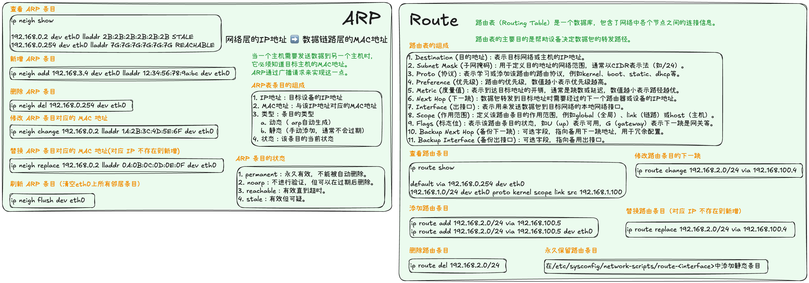
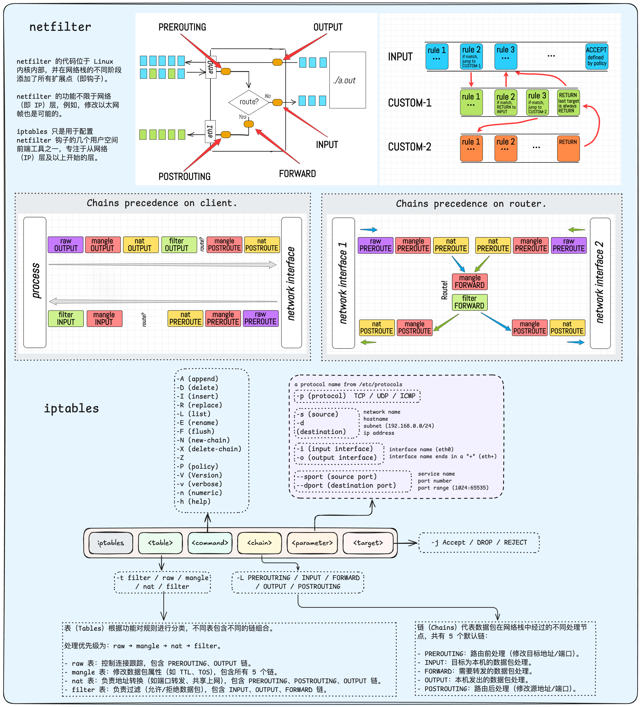

# Appendix

## Appendix A: Summary of Common Commands

### Data Link Layer Commands

- ARP
- Route

### Network Layer Commands

- iptables

## Appendix B: Sample Configuration Files

## Appendix C: Troubleshooting Guide

### DNS Troubleshooting

## Appendix D: Others

### Exit Codes

